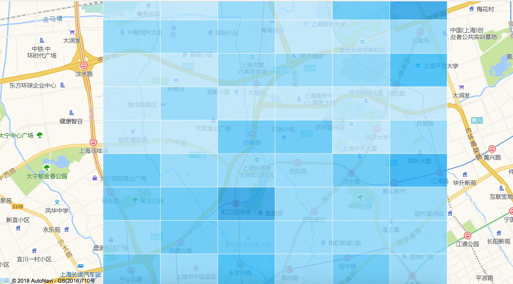

## 高德地图网格渲染库



### 安装依赖

```
npm i polyact
```

### Usage

```
import Polyact from 'polyact'

// 传入一个 AMap.Map 对象作为参数
const polyact = new Polyact(map)

polyact.render({
  type: 'grid',
  data,
  colors: ['#b1e4fe', '#7ed3fc', '#47c2Fa', '#17b5f9', '#00a8f7', '#009ae8'],
  created (result) {
    result.forEach(({
      polygon,
      data
    }) => {
      polygon.on('click', () => {
        infoWindow.open(map, polygon.getBounds().getCenter())
        infoWindow.setContent(`
          <div style="padding: 40px 80px;">区域数量：${data.count}</div>
        `)
      })
    })
  }
```

详细用法参见 [examples](./examples/app.js)

### API

#### polyact.render(options)

options 接受一个配置配置对象，各个字段如下：

```
{
  // 渲染的类型，内置 'grid' 类型用于渲染网格，用户可自定义其他类型渲染不同的形状
  type,
  // 渲染的数据，类型是一个数组，数组每项需包含如下字段
  /*
    count   该值决定热力区块颜色的深浅
    key     某个区块的唯一标识符，polyact 内部会根据该值做 diff，进而优化渲染。如果不传，每次 render 都将全量更新
    payload 除 count 外的其他额外数据，如果 type='grid'，该值为 geohash 或者网格四个顶点的坐标数组
  */
  data,
  // 热力图对应的颜色区间，数据越大，落到越后面的颜色区间
  colors,
  // 当热力图渲染完成后，执行该钩子，可以在这里为 polygon 定义事件等
  created (result) {}
}
```